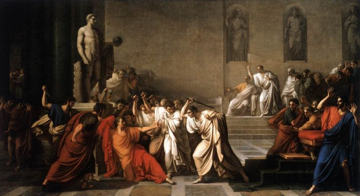

<div align="center">

<!-- Animated typing header with vintage colors -->


<br>

```ascii
╔═══════════════════════════════════════════════════════════╗
║                                                           ║
║     "Building tools, games, and systems that matter"     ║
║                                                           ║
╚═══════════════════════════════════════════════════════════╝
```

</div>

---

## 📌 About Me

<table>
<tr>
<td width="60%" valign="top">

Computer Science undergraduate at **Amrita Vishwa Vidyapeetham**. I build at the intersection of software development, game design, and system architecture. Focused on shipping functional products and learning through execution.

**Current Focus:** Web applications, game development, and open-source tooling  

**Approach:** Ship fast, iterate, refine

</td>
<td width="40%" valign="top">



</td>
</tr>
</table>

---

## 💻 Tech Stack

```cpp
class Developer {
    private:
        vector<string> languages = {"C++", "Python", "JavaScript", "C", "Java"};
        vector<string> web = {"React", "Node.js", "Flask", "HTML/CSS"};
        vector<string> gamedev = {"Unity", "Godot", "Blender"};
        vector<string> tools = {"Git", "Linux", "Bash", "Neovim"};
        
    public:
        string current_status = "Building SneakerNet & Spotifree";
        string learning = "Advanced algorithms & system design";
        
        void code() {
            while (true) {
                learn();
                build();
                ship();
            }
        }
};
```

<br>

## 🛠 Projects

<table>
<tr>
<td width="50%" valign="top">

**SneakerNet**  
Web platform for tracking shoe discounts, resale markets, and local deals. Aggregates pricing data to help users find the best value.

`React` `Node.js` `Web Scraping`

</td>
<td width="50%" valign="top">

**Spotifree**  
Privacy-focused media player for local and streaming playback. No accounts, no tracking, no subscriptions.

`Python` `Flask` `JavaScript`

</td>
</tr>

<tr>
<td width="50%" valign="top">

**Typing Tester**  
Speed typing game with moving targets. Built to improve typing accuracy and speed through gamification.

`JavaScript` `Canvas API`

</td>
<td width="50%" valign="top">

**Image to ASCII**  
Efficient C utility for converting images to ASCII art. Optimized for terminal output and file processing.

`C` `Image Processing`

</td>
</tr>

<tr>
<td colspan="2" valign="top">

**The Hollow Archive**  
Archive and community platform for horror fiction and creepypasta. Focus on atmosphere, curation, and reader engagement.

`Web Development` `Community Building`

</td>
</tr>
</table>

<br>

## 📈 Contribution Graph

<div align="center">


</div>

<br>

## 💭 Random Dev Quote

<div align="center">
  


</div>

<br>

## ⚡ Principles

```bash
$ cat approach.txt

├─ Execution over planning
├─ Iteration over perfection  
├─ Shipping over theorizing
└─ Learning through building

$ uptime
Building systems, solving problems, writing code.
```

<br>

## 🌐 Connect

<div align="center">

[](https://github.com/Sukanth19)
[](mailto:sukan3066@gmail.com)
[](https://discord.com/users/zynk__19)

<br>


</div>

---

<div align="center">
<sub>Last updated: 2025</sub>
</div>
